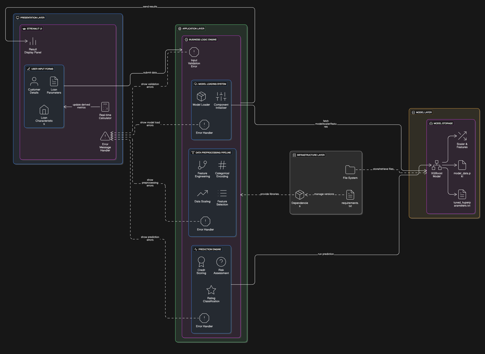

# 🏦 CrediWatch - Credit Risk Assessment System

[](https://streamlit.io/)
[](https://python.org/)
[](https://xgboost.ai/)


## 📋 Table of Contents
- [Overview](#overview)
- [Architecture Diagram](#architecture-diagram)
- [Features](#features)
- [Architecture](#architecture)
- [Installation](#installation)
- [Usage](#usage)
- [Model Performance](#model-performance)
- [Project Structure](#project-structure)
- [Deployment](#deployment)


## 🎯 Overview

CrediWatch is a comprehensive **Credit Risk Assessment System** that leverages advanced machine learning to evaluate borrowers' default risk, calculate credit scores, and assign risk ratings. Built with Python and Streamlit, it provides an intuitive web interface for real-time credit risk analysis.

### 🚀 Live Demo
**[Deploy on Streamlit Cloud](https://share.streamlit.io/)**

## 🖼️ Architecture Diagram

Below is the high-level architecture of the CrediWatch system:



---

## ✨ Features

- **🎯 Real-time Risk Assessment** - Instant credit risk evaluation with ML-powered predictions
- **📊 Interactive Dashboard** - User-friendly Streamlit interface with dynamic inputs
- **🤖 Advanced ML Model** - XGBoost-based prediction engine with 98% AUC performance
- **📈 Credit Scoring** - Automatic credit score calculation (300-900 scale)
- **🏷️ Risk Classification** - Intelligent risk rating assignment (Poor to Excellent)
- **🛡️ Error Handling** - Robust error handling and graceful failure recovery
- **📱 Responsive Design** - Works seamlessly across devices

## 🏗️ Architecture

### System Overview
CrediWatch follows a **modular architecture** with clear separation of concerns:

```
┌─────────────────────────────────────────────────────────────┐
│                    PRESENTATION LAYER                       │
│  ┌─────────────────┐  ┌─────────────────┐  ┌──────────────┐ │
│  │   Streamlit UI  │  │  Input Forms    │  │ Result Display│ │
│  │   (main.py)     │  │  (Validation)   │  │  (Charts)    │ │
│  └─────────────────┘  └─────────────────┘  └──────────────┘ │
└─────────────────────────────────────────────────────────────┘
                              │
                              ▼
┌─────────────────────────────────────────────────────────────┐
│                   APPLICATION LAYER                         │
│  ┌─────────────────┐  ┌─────────────────┐  ┌──────────────┐ │
│  │ Business Logic  │  │ Data Processing │  │ Prediction   │ │
│  │   (utils.py)    │  │   Pipeline      │  │   Engine     │ │
│  └─────────────────┘  └─────────────────┘  └──────────────┘ │
└─────────────────────────────────────────────────────────────┘
                              │
                              ▼
┌─────────────────────────────────────────────────────────────┐
│                    MODEL LAYER                              │
│  ┌─────────────────┐  ┌─────────────────┐  ┌──────────────┐ │
│  │   XGBoost       │  │  StandardScaler │  │ Feature      │ │
│  │   Classifier    │  │  (Preprocessing)│  │  Engineering │ │
│  └─────────────────┘  └─────────────────┘  └──────────────┘ │
└─────────────────────────────────────────────────────────────┘
```

### Data Flow
1. **User Input** → Form validation and data collection
2. **Feature Engineering** → LTI ratio, categorical encoding
3. **Data Preprocessing** → Scaling and feature selection
4. **Model Prediction** → XGBoost classification
5. **Score Calculation** → Credit score and rating assignment
6. **Result Display** → User-friendly output with insights

## 🛠️ Installation

### Prerequisites
- Python 3.8 or higher
- pip package manager
- Git

### Quick Start

1. **Clone the repository**
   ```bash
   git clone https://github.com/yourusername/crediwatch.git
   cd crediwatch
   ```

2. **Navigate to project directory**
   ```bash
   cd project-root
   ```

3. **Create virtual environment (recommended)**
   ```bash
   python -m venv venv
   
   # On Windows:
   venv\Scripts\activate
   
   # On macOS/Linux:
   source venv/bin/activate
   ```

4. **Install dependencies**
   ```bash
   pip install -r requirements.txt
   ```

5. **Run the application**
   ```bash
   streamlit run main.py
   ```

6. **Access the application**
   - Open your browser and go to `http://localhost:8501`
   - The application will automatically open in your default browser

## 📖 Usage

### Step-by-Step Guide

1. **Enter Customer Details**
   - **Age** (18-100 years): Customer's age
   - **Annual Income**: Total yearly income
   - **Loan Amount**: Requested loan amount

2. **Configure Loan Parameters**
   - **Loan Tenure** (6-240 months): Duration of the loan
   - **Average DPD**: Average Delinquent Days (default history)
   - **DMTLM**: Delinquent Months to Loan Month Ratio
   - **Credit Utilization Ratio** (0-100%): Percentage of credit used
   - **Total Loan Months**: Cumulative loan experience

3. **Select Loan Characteristics**
   - **Loan Purpose**: Education, Home, Auto, or Personal
   - **Loan Type**: Unsecured or Secured
   - **Residence Type**: Owned, Rented, or Mortgage

4. **Get Results**
   Click "Calculate Risk" to receive:
   - **Default Probability**: Risk of loan default
   - **Credit Score**: Numerical score (300-900)
   - **Risk Rating**: Poor, Average, Good, or Excellent
   - **Risk Insights**: Actionable recommendations

### Example Output
```
✅ Risk Assessment Completed!
Default Probability: 0.67%
Credit Score: 896
Rating: Excellent

🌟 The borrower has a low-risk profile. Loan approval is likely.
```

## 📊 Model Performance

### Technical Metrics
- **🎯 AUC Score**: 0.98 (Excellent discrimination)
- **📈 Gini Coefficient**: 0.97 (Strong predictive power)
- **📊 KS Statistic**: 86.87% (Excellent separation)
- **⚡ Response Time**: <2 seconds
- **🔄 Accuracy**: 98% on test data

### Model Architecture
- **Algorithm**: XGBoost (eXtreme Gradient Boosting)
- **Features**: 15 engineered features
- **Training**: Optimized hyperparameters with cross-validation
- **Output**: Binary classification with probability scores

### Feature Importance
1. **Loan-to-Income Ratio** (LTI)
2. **Age** of the borrower
3. **Credit Utilization** percentage
4. **Loan Amount** and **Income**
5. **Payment History** indicators

## 📁 Project Structure

```
CrediWatch/
├── README.md                     # 📖 This documentation
└── project-root/                 # 🚀 Main application
    ├── main.py                   # 🖥️ Streamlit application
    ├── utils.py                  # ⚙️ Core prediction engine
    ├── requirements.txt          # 📦 Python dependencies
    ├── Lauki Finance.JPG        # 🏢 Application logo
    └── model/                   # 🤖 Machine learning model
        ├── model_data.pkl       # 📊 Serialized XGBoost model
        └── tuned_hyperparameters.txt  # ⚙️ Model parameters
```

## 🚀 Deployment

### Streamlit Cloud Deployment

1. **Push to GitHub**
   ```bash
   git add .
   git commit -m "Initial commit"
   git push origin main
   ```

2. **Deploy on Streamlit Cloud**
   - Go to [share.streamlit.io](https://share.streamlit.io)
   - Connect your GitHub repository
   - Set deployment path to: `project-root/main.py`
   - Click "Deploy"

### Local Development
```bash
cd project-root
streamlit run main.py
```

### Docker Deployment (Optional)
```dockerfile
FROM python:3.9-slim
WORKDIR /app
COPY project-root/ .
RUN pip install -r requirements.txt
EXPOSE 8501
CMD ["streamlit", "run", "main.py", "--server.port=8501"]
```

## 🔧 Dependencies

### Core ML Libraries
| Library | Version | Purpose |
|---------|---------|---------|
| `scikit-learn` | 1.3.0 | Machine learning framework |
| `xgboost` | 1.7.6 | Gradient boosting model |
| `pandas` | 2.0.3 | Data manipulation |
| `numpy` | 1.24.3 | Numerical computing |
| `joblib` | 1.4.2 | Model serialization |

### Web Framework
| Library | Version | Purpose |
|---------|---------|---------|
| `streamlit` | 1.28.1 | Web application framework |

### Utilities
| Library | Version | Purpose |
|---------|---------|---------|
| `scipy` | 1.11.1 | Scientific computing |
| `setuptools` | 75.1.0 | Package management |
| `threadpoolctl` | 3.5.0 | Thread pool control |
| `wheel` | 0.44.0 | Package distribution |

## 🤝 Contributing

We welcome contributions! Please follow these steps:

1. **Fork the repository**
2. **Create a feature branch**
   ```bash
   git checkout -b feature/AmazingFeature
   ```
3. **Commit your changes**
   ```bash
   git commit -m 'Add some AmazingFeature'
   ```
4. **Push to the branch**
   ```bash
   git push origin feature/AmazingFeature
   ```
5. **Open a Pull Request**

### Development Guidelines
- Follow PEP 8 style guidelines
- Add tests for new features
- Update documentation as needed
- Ensure all tests pass before submitting


## 🙏 Acknowledgments

- **XGBoost Team** for the powerful gradient boosting library
- **Streamlit Team** for the amazing web framework
- **Scikit-learn Community** for the comprehensive ML toolkit

---

<div align="center">

**CrediWatch** - Your Trusted Credit Risk Assessment Partner

[](https://github.com/rishuSingh404/crediwatch)

</div>


